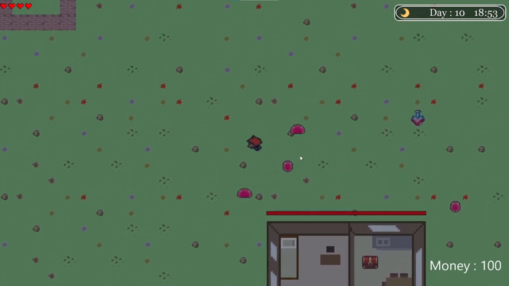
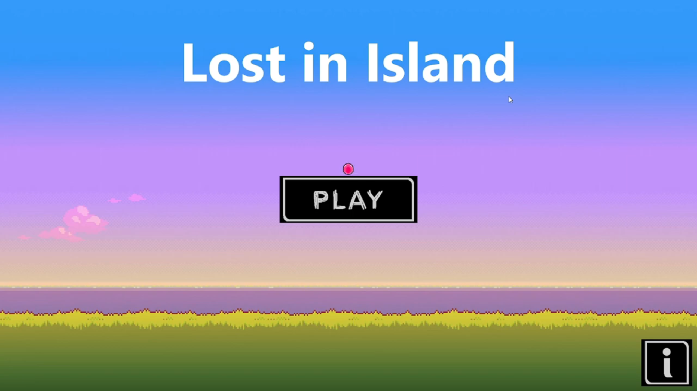
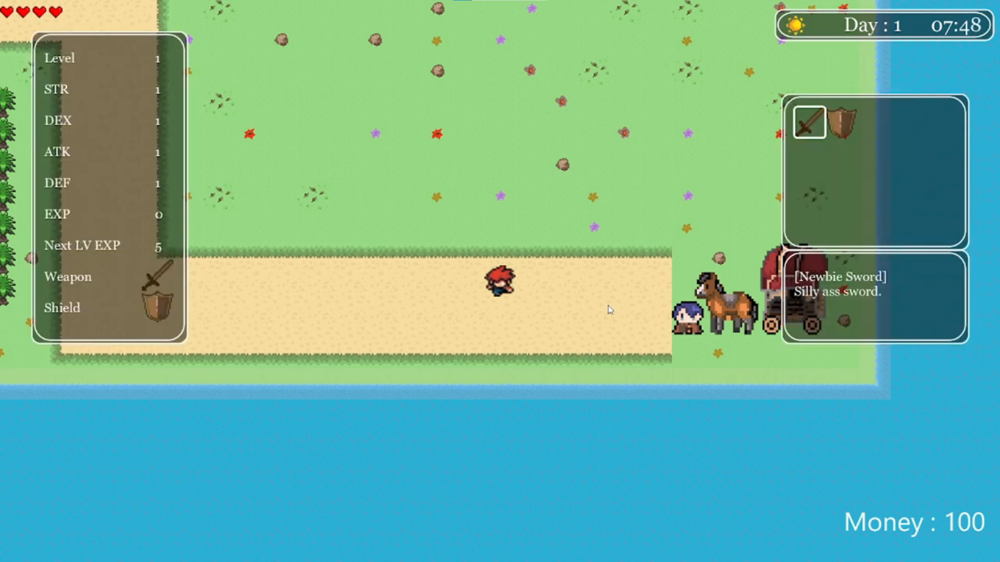
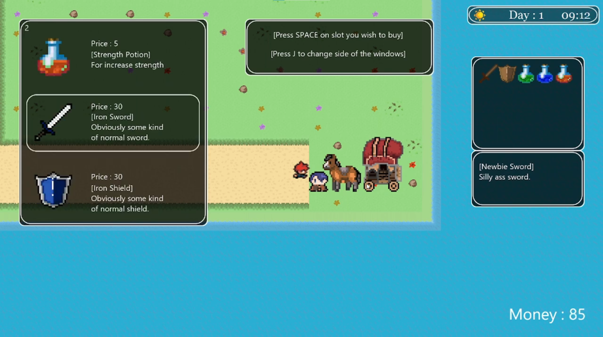

# Lost in Island
A JavaFX game built entirely from scratch

## Description
Lost in Island is a JavaFX-based game developed purely in Java. Every system, including character movement, time mechanics, rendering, utilities, and monster behavior, has been implemented from scratch without external libraries.

## Features
- Character Movement – Smooth player movement using JavaFX.
- Time System – Dynamic time management in-game.
- Rendering & Drawing – Custom rendering system for game elements.
- Combat & Interaction – Attack enemies and interact with the game world.
- Monster AI – Basic enemy behaviors and interactions.
## Installation & Setup
To run the game, follow these steps:

1. **Install Java SDK** - Ensure you have [Java JDK](https://www.oracle.com/java/technologies/javase-downloads.html) installed.

2. **Clone the Repository**
   ```sh
   git clone https://github.com/yourusername/Lost-in-Island.git
   cd Lost-in-Island
3. **Run the Game**
   ```sh
   git clone https://github.com/yourusername/Lost-in-Island.git
   cd Lost-in-Island
## Controls
- WASD – Move the character
- Spacebar – Attack
- Enter – Interact NPC
- J - Open Inventory
## Technologies Used
- 
- 
- 
  
## Screenshots
Here are some in-game screenshots:

### Fight Scene


### Menu


### Inventory


### Shop

